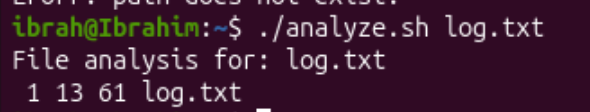
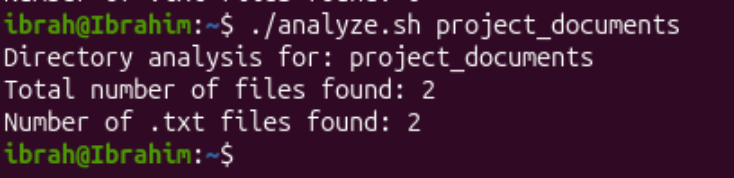

## Creating a shell script that accepts axactly one argument and returns its details as specified

```bash
nano analyze.sh
```
To create a file named analyze.sh and write contents into it


Ctrl + X to exit then Y to confirm save, Return.

To make the file executable, we run:
```bash
chmod +x analyze.sh
```


### 1. Passing file as argument
```
./analyze.sh log.txt
```

The log.txt file has 1 line, 13 words and 61 charecters

### 2. Passing directory as argument
```bash
./analyze.sh project_docuemnts
```


### 3. Invalid path
```bash
./analyze.sh mypath_that_doesnt_exist
```
