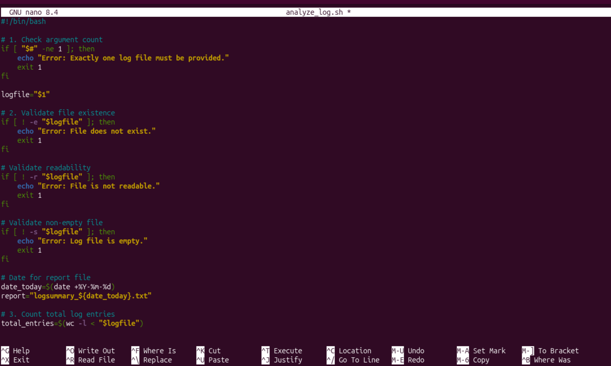
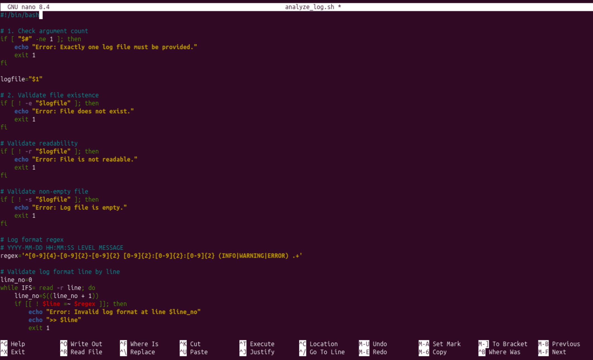
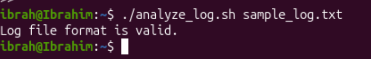
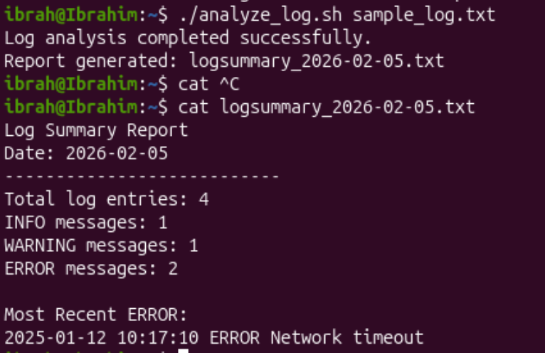

## Create a sheel script that validates if the provided log file as argument is in readable format


```bash
nano analyze_log.sh
```


Ctrl + X to exit then Y to confirm save, Return.

To make the file executable, we run:
```bash
chmod +x analyze.sh
```

Run the script:
```bash
./analyze_log.sh filename.txt
```

### 1. Invalid format passed


### 2. Valid file and format passed


### 3. Invalid path / non-existant file
