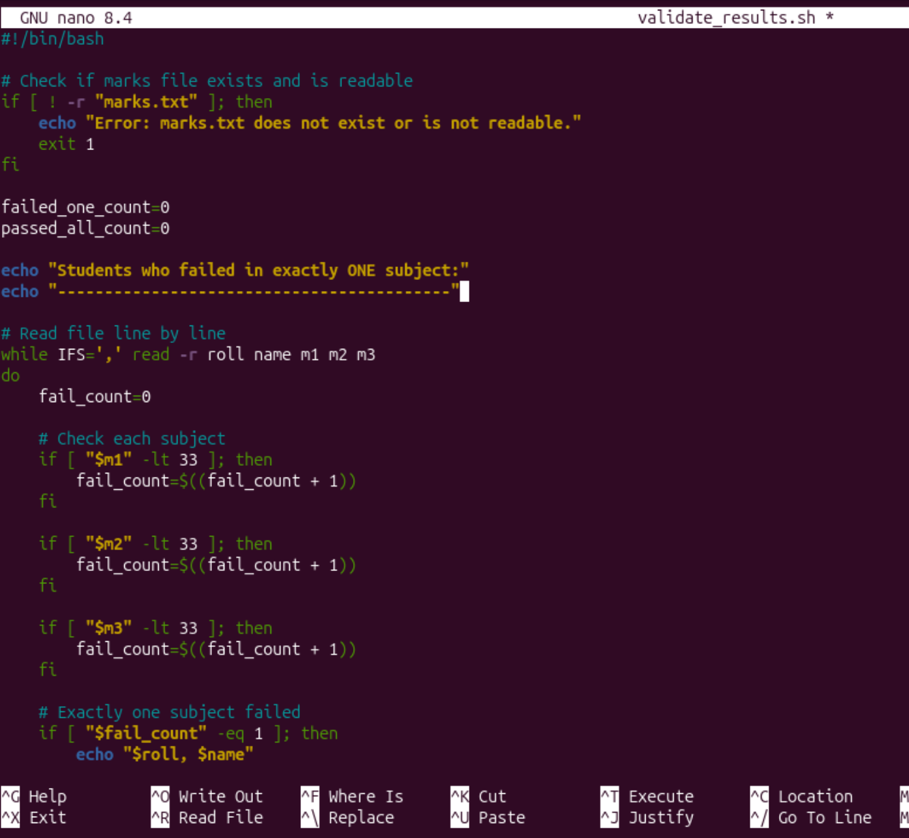
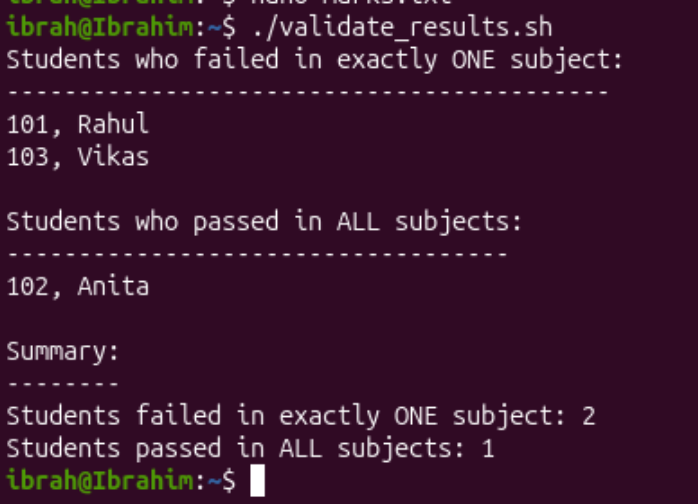

## Shell script that validates students marks data

```nano
validate_results.sh
```


Ctrl + X to exit then Y to confirm save, Return.

To make the file executable, we run:
```bash
chmod +x validate_results.sh
```

Run the script:
```bash
./validate_results.sh
```

Output:


