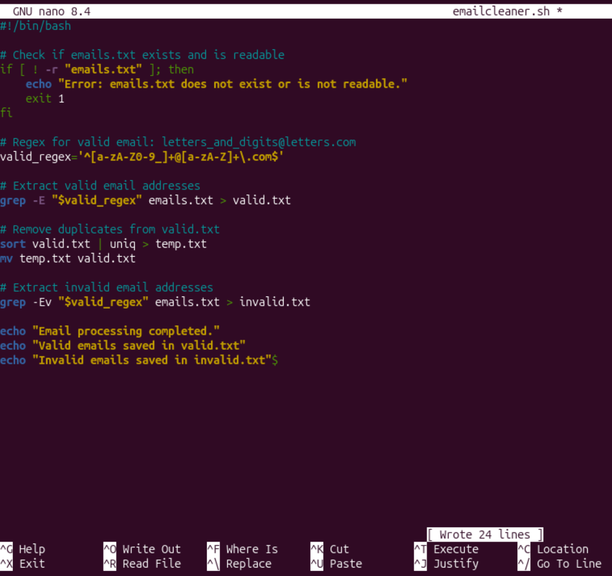
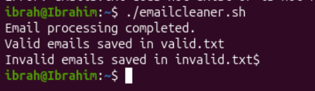

## Creating shell script that processes emails to clean them

```bash
nano emailcleaner.sh
```


Ctrl + X to exit then Y to confirm save, Return.

To make the script executable, we run:
```bash
chmod +x emailcleaner.sh
```

Run the script:
```bash
./emailcleaner.sh
```
Output:


