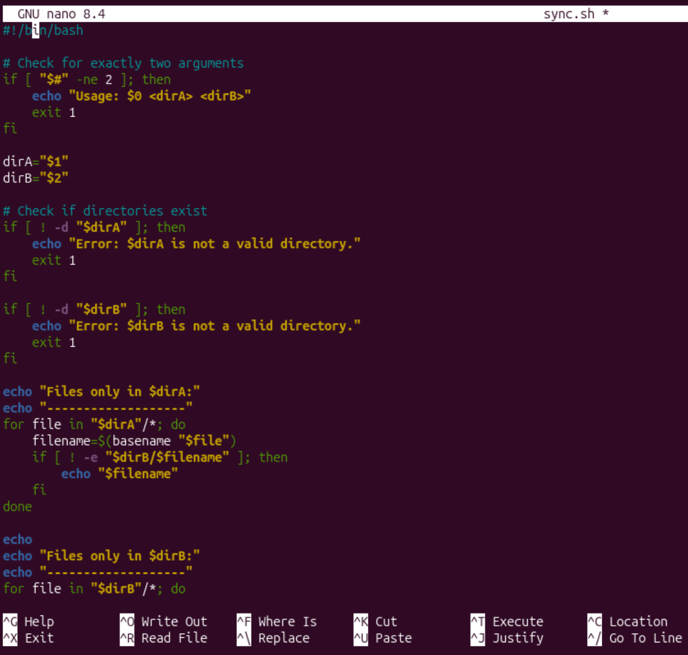

## Creating shell script that compares two directories to see if they have same files' name

```bash
nano sync.sh
```


Ctrl + X to exit then Y to confirm save, Return.

To make the script executable, we run:
```bash
chmod +x sync.sh
```
