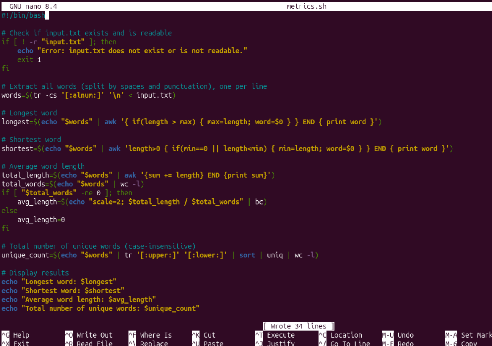
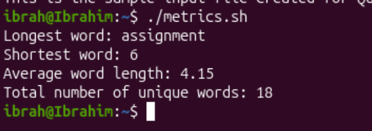

## Creating shell script that analyzes text file and outputs its details

```bash
nano metrics.sh
```


Ctrl + X to exit then Y to confirm save, Return.

To make the script executable, we run:
```bash
chmod +x metrics.sh
```

<b>Create the sample input file (input.txt)</b>
```bash
echo "This is the sample input file created for Question 6 of the staff graded assignment 2 for modules 5-10" >> input.txt
```

Run the script:
```bash
./metrics.sh
```
