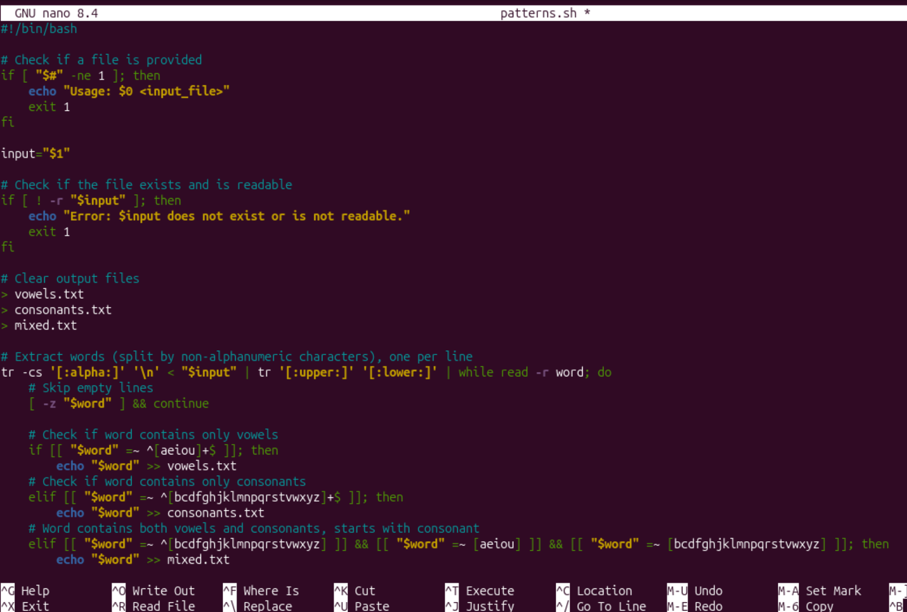

## Create Script that reads from a file and saperates vowels and consonants into different files and mixed file containing both


```bash
nano patterns.sh
```


Ctrl + X to exit then Y to confirm save, Return.

To make the script executable, we run:
```bash
chmod +x patterns.sh
```
