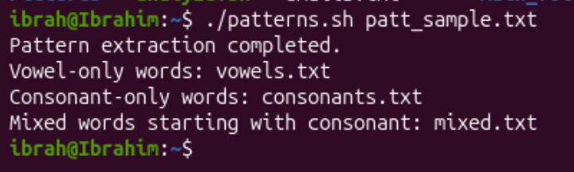

## Create Script that reads from a file and saperates vowels and consonants into different files and mixed file containing both


```bash
nano patterns.sh
```


Ctrl + X to exit then Y to confirm save, Return.

To make the script executable, we run:
```bash
chmod +x patterns.sh
```

<b>Create Sample File</b>
```bash
echo "I had an elephant with me as a pet but it wasn't long before it had passed away" >> patt_sample.txt
```

Run the script:
```bash
./patterns.sh patt_sample.txt
```
