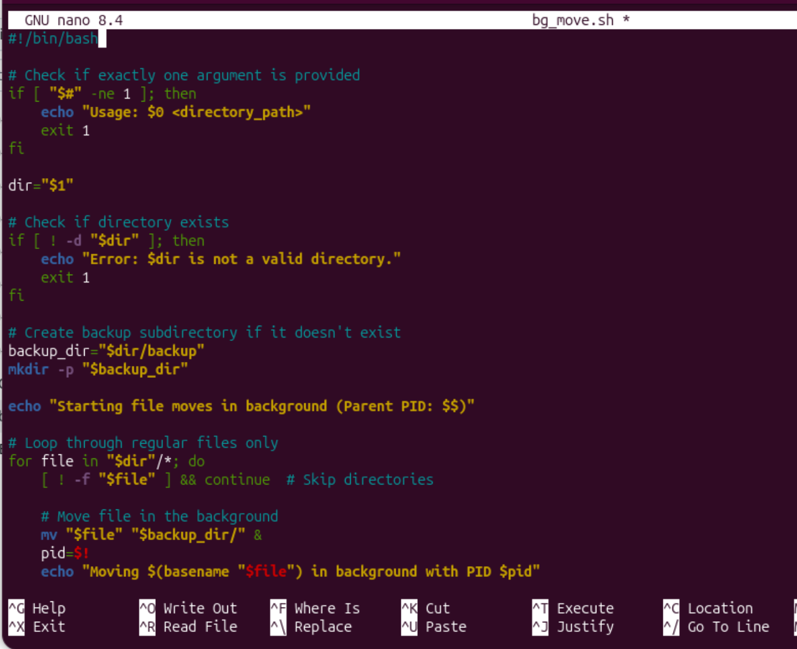
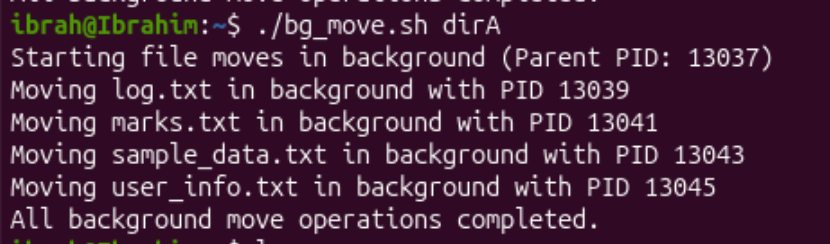

## Creating Shell Script that moves the files in the specified directory to a subdirectory 'backup'


```bash
nano bg_move.sh
```


Ctrl + X to exit then Y to confirm save, Return.

To make the script executable, we run:
```bash
chmod +x bg_move.sh
```

Run the Script:
```bash
./bg_move.sh dirA
```
Output:
